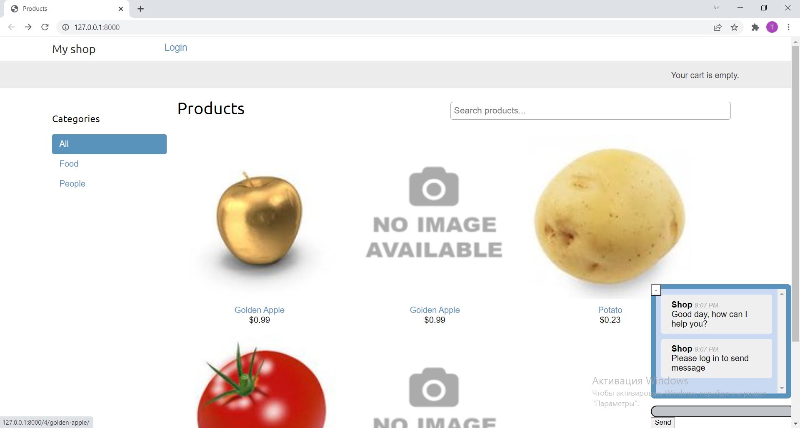
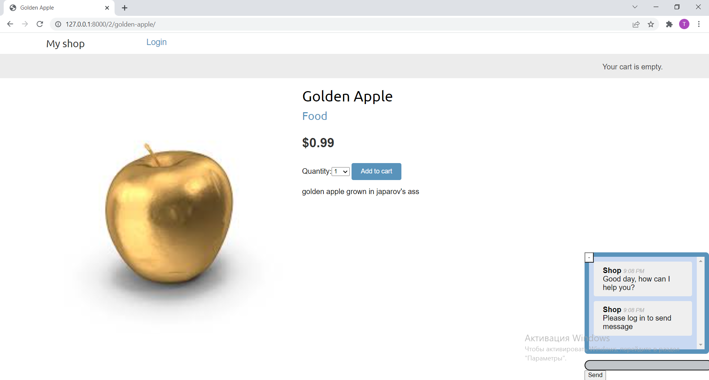
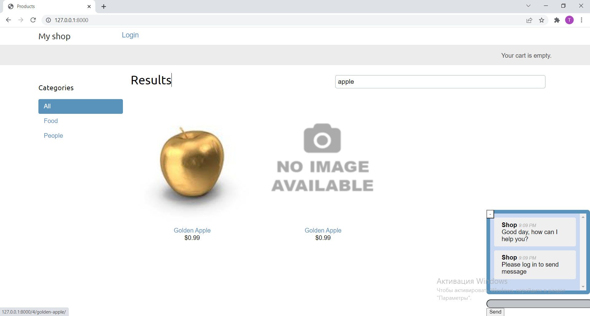
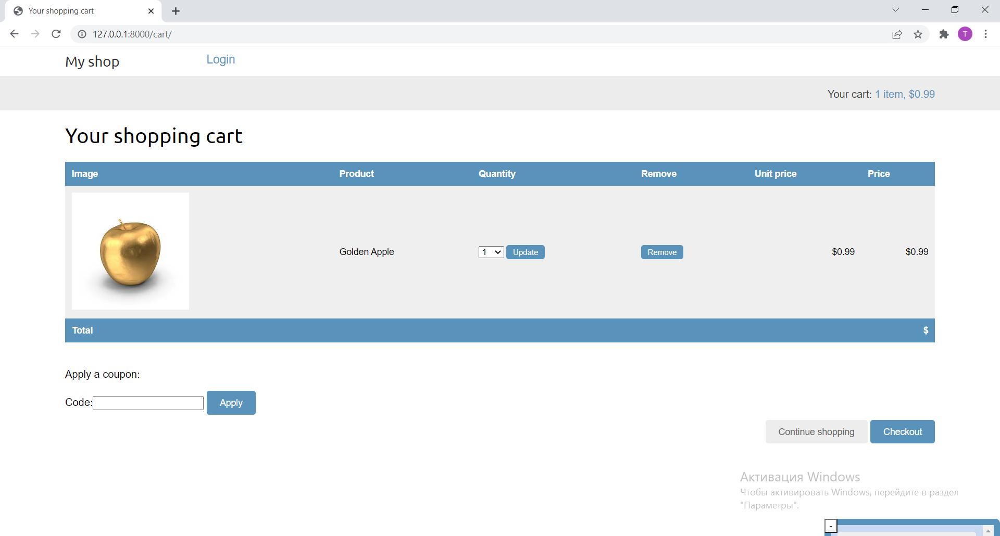

# E-Comemerce Shop

# Manual Installation 

1. To start project locally clone repository.
    $ git clone <> 

2. Go to src/ directory
    $ cd src

3. Run broker to deliver messages to celery workers:
    $ sudo rabbitmq-server service restart

4. Run redis channel layer to run chat app
    $ docker run -p 6379:6379 -d redis:5

6. Also run hard beat to perform periodic tasks sendimg mass mails:
    $ celery -A myshop beat -l info

7. Finally start celery workers:
    $ celery -A myshop worker -l info -Ofair --pool=solo

8. Follow this documentation to install elasticsearch https://www.elastic.co/guide/en/elasticsearch/reference/current/install-elasticsearch.html
    

9. After succesfull installation and setup run following command 
    $ sudo service elasticsearch start

10. Run server
    $ py manage.py runserver

# How it looks in running

